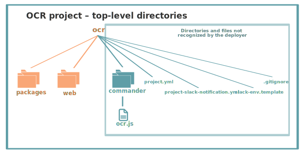
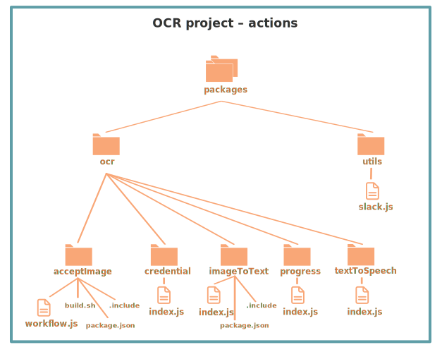
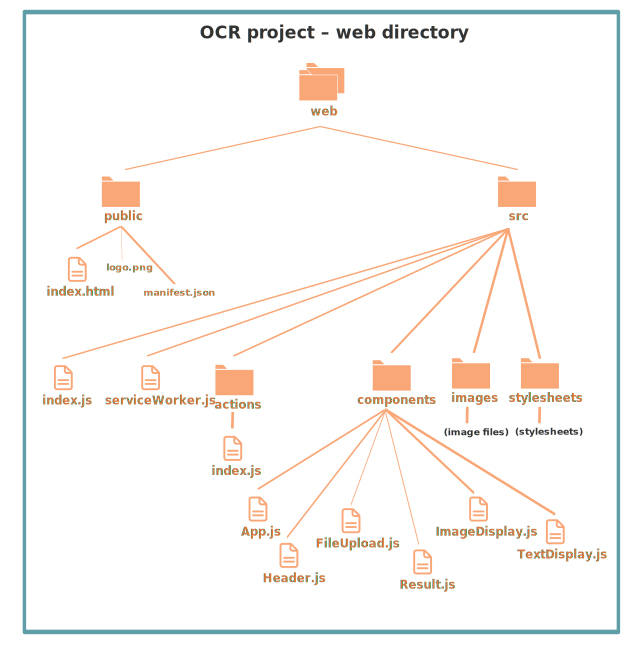

## OCR Tutorial

This tutorial explains the [Optical Character Recognition (OCR) demo](https://github.com/nimbella/demo-projects/tree/master/ocr) available on GitHub and shows you how to deploy it to the Nimbella Cloud.

This application displays a web page where visitors select a language (English, Spanish, or Chinese) and then drag a JPG, GIF, or PNG image onto the page, where it is automatically converted to text. If conversion is successful, users can read the text and click a Speak button to hear the text. You can [try out the application here](https://ocrdemo-apigcp.nimbella.io).

The OCR demo is an example of a serverless application using a React front end several functions on the back end. The [Tesseract OCR Engine](https://github.com/tesseract-ocr/tesseract) converts the images to text.

The OCR demo has the following code and configuration components:

-Application logic: The _packages_ directory contains several Nimbella actions, which are logical collections of functions.
  -
- Static web content: An _index.html_ file, which has an input area for a visitor to drag in an image, The manifest.json file provides metadata used [when your web app is added to the homescreen on Android](https://developers.google.com/web/fundamentals/web-app-manifest/).
- Slack application: A Nimbella Commander project folder called _commander_, with an _ocr.js_ file with an app that can be installed into Slack.

- A single index.html file, which has a field for a visitor to enter some text and click **Submit**.
- A single JavaScript file that provides the backend logic for the conversion of text to QR code.
- A Node package manager file called *package.json*, which describes what dependencies the function has.

## Project file structure

Nimbella relies on directory and file structure to intelligently deploy projects, so the GitHub project directory structrure is organized that way and is described below.

### Top-level directories

In any Nimbella project, the deployer looks for one or both of the following top-level directories:

- The _packages_ directory, which in this case contains one or more actions. In this case it contains several actions, described in the next section.
- The _web_ directory, which contains static web content, described below.

Any other directories or files that appear at the top level are ignored by the deployer. In this case, there's a third top-level directory called _commander_, which contains logic for a Slack application that is managed by [Nimbella Commander](https://nimbella.com/product/commander).

### Actions

Actions are discrete units of functional code in languages such as JavaScript, Node.js, or PHP. The _packages_ directory in the OCR demo contains the following directories and files.

In the diagram, code files that contain the logic for actions are shown with file icons and larger font labels, while project configuration and build files are displayed in smaller fonts without icons.

The first level of subdirectory within the _packages_ directory usually serves as the package qualifier of the actions contained within it. In the OCR demo, there are two packages:

  - The `ocr` package, which contains five actions:
    - acceptImage
      This action is a workflow that sequences other actions, invoking the `ocr/imageToText` action at the proper point and invoking the `utils/slack` action to send a notification and the OCR results to Slack (assuming the Commander app is installed into Slack).
    - credential
    - imageToText
    - textToSpeech
  - The `utils` package, which contains one action:
    - slack

The full action names are therefore `ocr/acceptImage`, `ocr/credential`, `utils/slack`, and so on. For simple applications, the deployer recognizes these actions without any further project configuration.

Each of the action directories contains one file with the code logic, and as you can see in the diagram, some directories have other files that fine-tune project configuration and build instructions.

### Web content

The *web* directory contains the  web content for the project, and the result is a single HTML page. In the back end, the _index.html_ file is a template for the content that will be generated with React UI components and other JavaScript in the _src_ directory.

[[NH: Does the `npm run build` or `yarn build` run automatically during deployment, or does it have to be run manually?]]

The starting point of the React logic is _index.js_ in the _web/src_ directory. It imports various React components and CSS, and it imports and renders _App.js_ from the _components_ subdirectory.

App.js contains the sequencing of the other components. It imports _Header_, _FileUpload_, and _Result_. It also adds handlers for various components (language, browsing, camera, file upload) and creates some of the HTML markup. The `Result` code imports the `ImageDisplay` and `TextDisplay` components that control how the image and text are displayed after OCR occurs. If you're tried the demo, it's fairly easy to see what these component refer to.

### Notes on package.json
The *package.json* file in the *qr* directory triggers an automatic build of the action when the *qr.js* file is modified. For more information about builds, see the [section on incorporating build steps in the Nimbella Command Line Tool document](https://nimbella.io/downloads/nim/nim.html#incorporating-build-steps-for-actions-and-web-content).

### Deploy this project to the Nimbella Cloud
If you have the [Nimbella command line tool called `nim`](https://nimbella.io/downloads/nim/nim.html#install-the-nimbella-command-line-tool-nim) installed, you can deploy this project directly from GitHub, either online or from the local repository  cloned to your  disk.

- Run the following command in your terminal:

   `nim project deploy /path/to/qrcode`

   The output of this command will include a link to where the application is running in the cloud.
