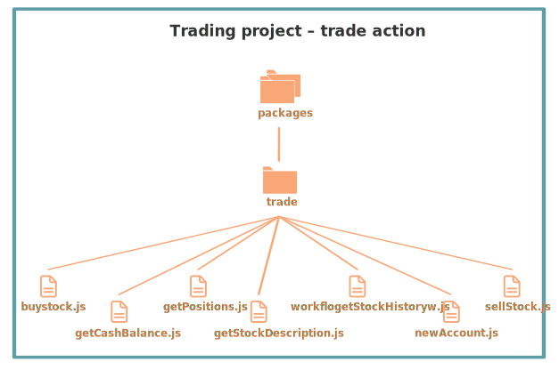
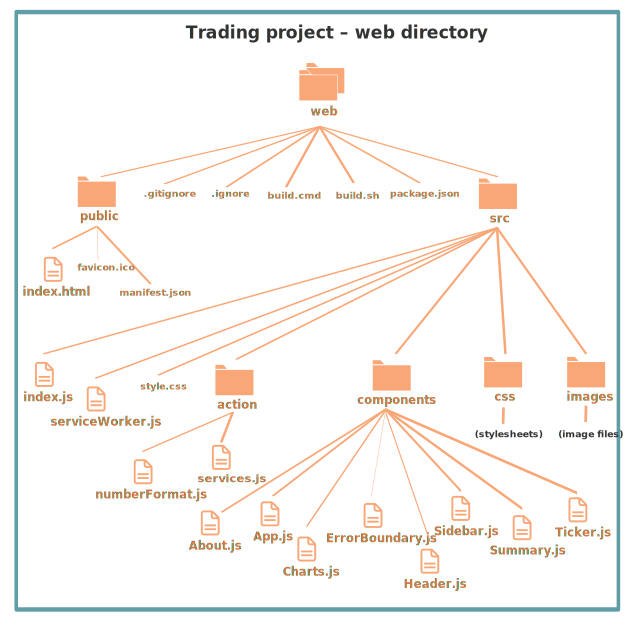

## Stock Trading Tutorial

This tutorial explains the [Nimbella Stock Trading demo](https://github.com/nimbella/demo-projects/tree/master/trade) available on GitHub and shows you how to deploy it to the Nimbella Cloud.

The Stock Trading application displays a web page with two columns. In the left column, you can buy and sell stocks. The right column displays live stock information provided by IEX Cloud, based on which stock is selected in the left column.  You can [try out the application here](https://ocrdemo-apigcp.nimbella.io).

In this screenshot, the left pane shows that one share of Netflix stock was purchased using the **Buy** button, and the right pane displays Netflix stock information plus live trading data.

The Stock Trading demo is an example of a serverless Nimbella Cloud application with a [React front end](https://reactjs.org), Node.js on the back end, and the use of the built-in Nimbella key-value store. It also has a Swagger OpenAPI definition, coded in YAML.

### Prerequisite: Get an IEX Cloud API token

In order to display the stock information in the right column, you'll need to provide an IEX Cloud API token. Here's how to get a free IEX Cloud account to obtain an API token.

  1. Go to <https://iexcloud.io>.
  2. Click the **Get started** button.
  3. Choose an **Individual** account and enter your name, an email address, and a password, then click **Create account**.
  4. Locate the **Get started for free** section and click **Select start**.
  5. You'll receive an email with a link that verifies your account and opens your IEX Cloud console.
  6. Click Go to API tokens to copy your secret API token.
  7. **[[NH: Move this step to later in the doc.]]** Place the API token for the IEX Cloud into the environment as environment variable `IEXCLOUD_API_TOKEN` when using the Nimbella deployer to deploy this project. One way to do this is to use a .env file as described in the [Nimbella deployer documentation](https://nimbella.io/downloads/nim/nim.html#symbolic-variables).

-------->DELETE?

The OCR demo has the following code and configuration components, described in more detail later:

- Application logic: The _packages_ directory contains several Nimbella actions, which are logical collections of functions.
- Static web content: The _web_ directory contains a _public_ directory, with the files that will be part of the public website, and a _src_ directory with React component files and other JavaScript files that are built into the _index.html_ template page to produce the final static public page.
- Slack application: A Nimbella Commander project folder called _commander_, with an _ocr.js_ file with an app that can be installed into Slack.

<-----

### Stock Trading project structure and logic

Nimbella relies on directory and file structure to intelligently deploy projects, so the GitHub project directory structure is organized for Nimbella deployment as described below. For more information about creating and deploying Nimbella Cloud projects, see the [Nimbella Command Line Tool (nim) Guide](https://nimbella.io/downloads/nim/nim.html).

In the following diagrams, files that contain code or web content are shown with file icons and larger font labels, while project configuration and build files are displayed in smaller fonts without icons.

#### Top-level directories

In any Nimbella project, the deployer looks for one or both of the following top-level directories:

- A _packages_ directory, which contains the back end logic of the project.
- A _web_ directory, which contains static web content that is published to the front end of the application. In this demo, the _web_ directory contains React component files, described further below.

The _packages_ and _web_ directory contents are described in the following sections.

There are also several configuration files. The _project.yml_ file in the this demo sets the IEX Cloud API token as a parameter for the tradedemo package.

#### Actions in the packages directory

Actions are discrete units of functional code in languages such as JavaScript, Node.js, or PHP, and this demo uses Node.js.

In the Stock Trading demo, the _packages_ directory contains one package called _trade_ with seven actions, shown in this diagram and described below:

  * buyStock
  --->Provides a workflow that sequences other actions, invoking the `ocr/imageToText` action at the proper point and invoking the `utils/slack` action to send a notification and the OCR results to Slack (assuming the Commander app is installed into Slack).<---
  * getCashBalance
  --->This action specifies secure get and put operations between the web page and the storage bucket.
  * getPositions
  --->Provides logic for the Tesseract conversion of the image to text.
  * getStockDescription
  --->Uses the Redis key-value store provided with your Nimbella namespace to track progress, status, and the OCR text to be displayed.
  * getStockHistory
  --->Routes the text through Google Translate to be synthesized to speech.
  * newAccount
  --->Uses...
  * sellStock
  --->Provides...

Packages are used as qualifiers in action names, so the full action names are therefore `trade/buyStock`, `trade/getCash Balance`, and so on.

##### Build files
Some of the action directories have build files, which trigger an automatic build within the directory in which it's placed any time the code file is modified. In the case of the _acceptImage_ directory, there's a _build.sh_ file, which contains shell commands to run an `npm install` and `npm run build` of that directory. The _package.json_ file specifies the common Node.js dependencies of the code.

### Web content
The Nimbella deployer looks for a directory called _web_ for static web content. The OCR demo contains the  _web_ directory structure shown in the following diagram.

#### Top-level web directory structure

The _web/public_ directory contains the files that will appear in the public website location. The public/index.html_ file is a template for the content that will be generated with React UI components and other JavaScript in the _src_ directory. The _public/manifest.json_ file provides metadata used [when your web app is added to the homescreen on Android](https://developers.google.com/web/fundamentals/web-app-manifest/).

The _build.sh_ file in the _web_ directory runs _npm install_ and _npm run build_ to generate content from the _src_ directory's React components into the _index.html_ file. This happens automatically every time a file is modified.

#### src directory structure

The starting point of the React logic is _index.js_ in the _src_ directory. It imports various React components and CSS, and it imports and renders _App.js_ from the _components_ subdirectory.

_App.js_ contains the sequencing of the other components. It imports _Header_, _FileUpload_, and _Result_. It also adds handlers for various components (language, browsing, camera, file upload) and creates some of the HTML markup. The `Result` code imports the `ImageDisplay` and `TextDisplay` components that control how the image and text are displayed after OCR occurs. If you've tried the demo, it's easy to see what these components refer to.

### Deploy this project to the Nimbella Cloud
If you have the [Nimbella command line tool called `nim`](https://nimbella.io/downloads/nim/nim.html#install-the-nimbella-command-line-tool-nim) installed, you can deploy this project directly from GitHub, either online or from the local repository  cloned to your  disk.

- Run the following command in your terminal:

   `nim project deploy /path/to/ocr`

The output of this command will include a link to where the application is running in the cloud.
