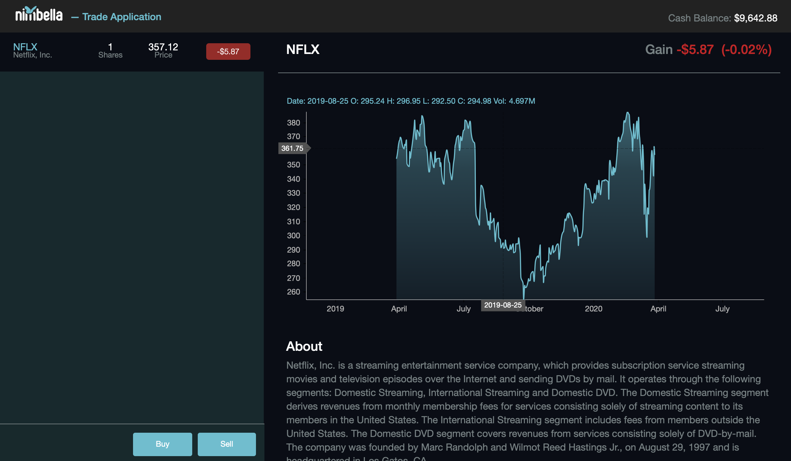
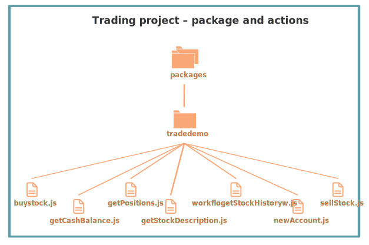
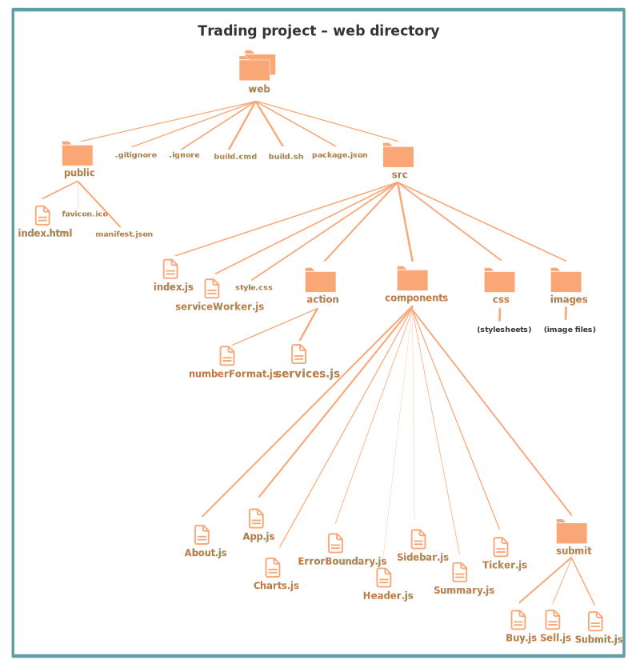

## Stock Trading Tutorial

This tutorial explains the [Nimbella Stock Trading demo](https://github.com/nimbella/demo-projects/tree/master/trade) available on GitHub and shows you how to deploy it to the Nimbella Cloud.

The Stock Trading application displays a web page with two columns. In the left column, you can buy and sell stocks. The right column displays live stock information provided by IEX Cloud based on the stock selected in the left column. You can [try out the application here](https://ocrdemo-apigcp.nimbella.io).

In this screenshot, the left pane shows that one share of Netflix stock was purchased using the **Buy** button, and the right pane displays Netflix stock information plus live trading data.



The Stock Trading demo is an example of a serverless Nimbella Cloud application with a [React front end](https://reactjs.org), Node.js on the back end, and the use of the built-in Nimbella key-value store. It also has a Swagger OpenAPI definition, coded in YAML.

### Prerequisite: Get an IEX Cloud API token

In order to display the stock information in the right column, you'll need to provide your own IEX Cloud API token. Here's how to get a free IEX Cloud account to obtain an API token.

  1. Go to <https://iexcloud.io>.
  2. Click the **Get started** button.
  3. Choose an **Individual** account and enter your name, an email address, and a password, then click **Create account**.
  4. Locate the **Get started for free** section and click **Select start**.
  5. You'll receive an email with a link that verifies your account and opens your IEX Cloud console.
  6. Click Go to API tokens to see your secret API token.
  Instructions for adding this token to your deploy command or adding it as a symbolic variable are given at the end of this tutorial.

### Project structure and logic

The Stock Trading demo in GitHub is set up as a typical Nimbella project.

The application has the following code and configuration components:

- Back end application logic

  The _packages_ directory contains several Nimbella actions, which are logical collections of functions.

- Static web content
  The _web_ directory contains static web content that is rendered by means of React components and actions, described in more detail below.

Nimbella relies on directory and file structure to intelligently deploy projects, so the GitHub project directory structure is organized as described in this section.

**Note:** Nimbella can deploy directly from GitHub directories. For more information about creating and deploying Nimbella Cloud projects, see the [Nimbella Command Line Tool (nim) Guide](https://nimbella.io/downloads/nim/nim.html).

In the following diagrams, files that contain code or web content are shown with file icons and larger font labels, while project configuration and build files are displayed in smaller fonts without icons.

#### Top-level directories


In any Nimbella project, the deployer looks for one or both of the following top-level directories:

- A _packages_ directory, which contains the back end logic of the project.
- A _web_ directory, which contains static web content that is published to the front end of the application. In this demo, the _web_ directory contains React component and action files that are rendered into an _index.html_ file.

The _packages_ and _web_ directory contents are described in the following sections.

There are also several configuration files. The _project.yml_ file in  this demo sets an `apitoken` parameter of the tradedemo package to the sybolic variable `${IEXCLOUD_API_TOKEN}`. In the last section of this tutorial, we'll tell you where to put your secret IEX Cloud API token.

#### Actions in the packages directory

Actions are discrete units of functional code in languages such as JavaScript, Node.js, or PHP, and this demo uses Node.js.

In this project, the _packages_ directory contains one package called _tradedemo_ with seven actions, shown in this diagram and described below:



The logic in each action should be apparent from what you saw when you tried out the app:

  * buyStock
  * getCashBalance
  * getPositions
  * getStockDescription
  * getStockHistory
  * newAccount
  * sellStock

Packages are used as qualifiers in action names, so the full action names are  `tradedemo/buyStock`, `tradedemo/getCash Balance`, and so on.

##### Build files
Some of the action directories have build files, which trigger an automatic build within the directory in which it's placed any time the code file is modified. In the case of the _acceptImage_ directory, there's a _build.sh_ file, which contains shell commands to run an `npm install` and `npm run build` of that directory. The _package.json_ file specifies the common Node.js dependencies of the code.

### Web content
The Nimbella deployer looks for a directory called _web_ for static web content. The OCR demo contains the  _web_ directory structure shown in the following diagram.



#### _web_ directories and files

##### _web/public_ directory

The _public_ directory contains the files that  appear in the public website location. The _public/index.html_ file is a template for the content that will be generated from React UI components and other JavaScript in the _src_ directory.

The _public/manifest.json_ file provides metadata used [when your web app is added to the homescreen on Android](https://developers.google.com/web/fundamentals/web-app-manifest/).

##### Files in the _web_ directory

At the top level of the _web_ directory, _build.sh_ (Mac and Linux) and _build.cmd_ (Windows) trigger automatic builds whenever a file is changed.

These build files contain the `npm install` and `npm run build` commands. The sripts that the `npm run` command uses are defined in the `scripts` parameter in  _package.json_ file, which also defines the React script dependencies and version numbers to be used.

#### _src_ directory structure

The starting point of the React logic is _index.js_. It imports  and renders _App.js_ from the _components_ subdirectory and sets the virtual DOM.

_App.js_ imports the other React components and several services from  _src/actions/services.js_. It also adds handlers for various components and renders some of the HTML markup. If you've tried the demo, it's fairly easy to see what these components refer to.

### Deploy this project to the Nimbella Cloud

If you have the [Nimbella command line tool called `nim`](https://nimbella.io/downloads/nim/nim.html#install-the-nimbella-command-line-tool-nim) installed, you can deploy this project directly from GitHub, either online or from the local repository  cloned to your  disk.

This is where you can make a decision about whether to use your secret IEX Cloud API token on the command line or as a symbolic variable, as described in the [Nimbella deployer documentation](https://nimbella.io/downloads/nim/nim.html#symbolic-variables).

You can specify an environment variable explicitly in the deploiyment command:

```
nim project deploy /path/to/trade --env <my-api-token>
```

where `<my-api-token>` is your secret IEX Cloud API token.

Because the API token is secret, a better method is to create an _.env_ file at the top level of the project with the following key-value pair:

```
IEXCLOUD_API_TOKEN=<my-api-token>
```

where `<my-api-token>` is your secret IEX Cloud API token.

If the deployer finds an _.env_ file at the top level of the project, you don't need to use the --env parameter in the deploy command, so you can deploy with this simple command:

```
nim project deploy /path/to/trade
```
#### Result of running the deploy command

The output of this command includes a link to where the application is running in the cloud.
