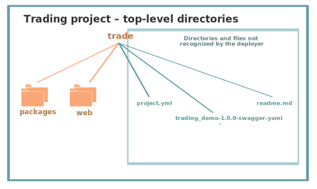

## Stock Trading Tutorial

This tutorial explains the [Nimbella Stock Trading demo](https://github.com/nimbella/demo-projects/tree/master/trade) available on GitHub and shows you how to deploy it to the Nimbella Cloud.

The Stock Trading application displays a web page with two columns. In the left column, you can buy and sell stocks. The right column displays live stock information provided by [IEX Cloud](https://iexcloud.io), based on the stock selected in the left column. You can [try out the application here](https://tradedemo-apigcp.nimbella.io).

In this screenshot, the left pane shows that one share of Netflix stock was purchased using the **Buy** button, and the right pane displays Netflix stock information plus live trading data.


The Stock Trading demo is an example of a serverless Nimbella Cloud application with a [React front end](https://reactjs.org), Node.js on the back end, and the use of the Nimbella Cloud platform's built-in [Redis](https://redis.io) key-value store.

### Prerequisite: Get an IEX Cloud API token

In order to display the stock information in the right column, you'll need to have your own IEX Cloud API token. Here's how to get a free IEX Cloud account to obtain one.

  1. Go to <https://iexcloud.io>.
  2. Click the **Get started** button.
  3. Choose an **Individual** account and enter your name, an email address, and a password, then click **Create account**.
  4. Locate the **Get started for free** section and click **Select start**.
  5. You'll receive an email with a link to verify your account and open your IEX Cloud console.
  6. From the console, click **Go to API tokens** to see your secret API token.

  Instructions for adding this token to your environment are given at the end of this tutorial.

### Project structure and logic

The Stock Trading demo in GitHub is set up as a typical Nimbella project, with a division between its back-end logic and its front-end static web content. Nimbella relies on directory and file structure to intelligently deploy projects, so the GitHub project directory structure is organized as described in this section.

**Note:** Nimbella can deploy directly from GitHub directories. For more information about creating and deploying Nimbella Cloud projects, see the [Nimbella Command Line Tool (nim) Guide](https://nimbella.io/downloads/nim/nim.html).

In the following diagrams, files that contain code or web content are shown with file icons and larger font labels, while project configuration and build files are displayed in smaller fonts without icons.

#### Top-level directories



In any Nimbella project, the deployer looks for one or both of the following top-level directories:

- A _packages_ directory, which contains the back end logic of the project.
- A _web_ directory, which contains static web content that is published to the front end of the application.
  In this demo, the _web_ directory contains React component and action files that are rendered into an _index.html_ file.

The _packages_ and _web_ directory contents are described in the following sections.

Any other directories and files that appear at the top level are not deployed. In this demo there are several project files at the top level, shown in blue in the diagram:

* _project.yml_
  Defines the `tradedemo` package with the parameter `apitoken: ${IEXCLOUD_API_TOKEN}`. We'll show you how to set `IEXCLOUD_API_TOKEN` as an environment variable at the end of this document.

* _trading_demo-1.0.0-swagger.yaml_
  A Swagger API definition for the back-end functions in the _packages_ directory.

* _readme.md_
  The readme file for the GitHub project.

#### Actions in the packages directory

Actions are discrete units of functional code in languages such as JavaScript, Node.js, or PHP. This demo uses Node.js.

In this project, the _packages_ directory contains one package called _tradedemo_ with seven actions, shown in this diagram and described below:


The logic in each action should be apparent from what you saw when you tried out the app:

  * buyStock
  * getCashBalance
  * getPositions
  * getStockDescription
  * getStockHistory
  * newAccount
  * sellStock

The functions in these actions use Nimbella Cloud's Redis key-value store to manage persisted data. You can see whether Redis is enabled for your Nimbella Cloud account by [viewing your credential store](https://nimbella.io/downloads/nim/nim.html#view-the-credential-store).

Packages are used as qualifiers in action names, so the full action names are `tradedemo/buyStock`, `tradedemo/getCash Balance`, and so on.

### Web directories and files
The Nimbella deployer looks for a _web_ directory for all front-end files and code. See the Nimbella CLI documentation for more [information about adding web content](https://nimbella.io/downloads/nim/nim.html#adding-static-web-content).

The Stock Trading demo contains the _web_ directory structure shown in the following diagram and described below.


#### _web/public_ directory

The _public_ directory contains the files that  appear in the public website location. In this case, the _public/index.html_ file is a template for the content that will be generated from React UI components and other JavaScript in the _web/src_ directory.

The _public/manifest.json_ file provides metadata used [when your web app is added to the homescreen on Android](https://developers.google.com/web/fundamentals/web-app-manifest/).

#### Top-level files in the _web_ directory

At the top level of the _web_ directory, _build.sh_ (Mac and Linux) and _build.cmd_ (Windows) trigger automatic builds whenever a file is changed.

These build files contain the `npm install` and `npm run build` commands. The scripts that the `npm run` command uses are specified in the `scripts` parameter in the _package.json_ file, which also defines React script dependencies and version numbers.

#### _web/src_ directory

The starting point of the React logic is _index.js_. It imports  and renders _App.js_ from the _src/components_ directory and sets the virtual DOM.

_App.js_ imports the other React components and several services from  _src/actions/services.js_. It also adds handlers for various components and renders some of the HTML markup. If you've tried the demo, it's fairly easy to see what these components refer to.

### Place the secret IEX Cloud API token in the environment

The demo code uses the symbolic variable `${IEXCLOUD_API_TOKEN}` for the secret IEX Cloud API token, so you can choose from a few different methods to place the actual token into the environment, as described in the [Nimbella Command Line Tool documentation](https://nimbella.io/downloads/nim/nim.html#symbolic-variables).

One method is to set the environment variable in a _.env_ file at the top level of the project as a key-value pair:

```
IEXCLOUD_API_TOKEN=<my-api-token>
```

where `<my-api-token>` is your secret IEX Cloud API token.

The `deploy` command, described in the next section, looks for this file and you don't have to specify an `--env` parameter when you run the command. By virtue of being placed in the top-level project directory, the _.env_ file isn't deployed and the file isn't committed to source control.

Another method is to set the token in the environment (`export VARIABLE=value`) so it's never part of the code. When it’s deployed, the key is stored with the action in the database.

### Deploy this project to the Nimbella Cloud

If you have the [Nimbella command line tool called `nim`](https://nimbella.io/downloads/nim/nim.html#install-the-nimbella-command-line-tool-nim) installed, you can deploy this project directly from GitHub, either online or from the local repository  cloned to your  disk with this simple command:

```
nim project deploy /path/to/trade
```

#### Result of running the deploy command

The output of this command includes a link to where the application is running in the cloud.
