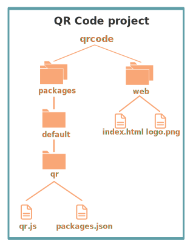

## Page Visit Counter Tutorial

This tutorial explains the [Visits demo](https://github.com/nimbella/demo-projects/tree/master/visits). This demo app displays on a web page how many times the page has been uniquely visited since the project was deployed.

This project runs in the Nimbella Cloud and so is a serverless app with the following components:

- A web front end with a single HTML file.
- Two functions
- One state

The backend is implemented in PHP.

This tutorial describes the demo app and shows you how to deploy it to the Nimbella Cloud.

### Project file structure

The GitHub project has the file structure that Nimbella uses to intelligently deploy the project:

Here are the basics of the file structure of this project.

- The *packages* directory contains the project's actions, and in this example there's only one. The first subdirectory name usually serves as the package qualifier, but when it's named *default*, no qualifier is prepanded to the action name. The next subdiretory, *qr*, is the name of the action, and the *qr.js* file contains the logic for that action.

- The *web* directory contains the static web content for the project. In this case, there is just one HTML file and one image.

-----
from **readme.md**:

Prerequisites

The project is intended for the Nimbella Cloud. Projects are deployed using the Nimbella command line tool called nim. You can install it from nimbella.io if you don't have it already installed. Once downloaded, use nim auth login <token> to login to the desired cloud namespace which will host this project once deployed.

Deploy Project

Run nim project deploy . to deploy the project then visit the shown link to see your project running in the cloud.

----------

### Notes on QR logic

The code for the QR action is standard Node.js. It uses an existing Node [library](https://www.npmjs.com/package/qrcode) for the actual code generation.

### Notes on QR web content

The *index.html* file contains the usual markup and logic that you'd write for standard web deployment, with an input form for text. In this case, it calls an API to retrieve a QR code for the form input. This API is implemented by *qr.js*.

### Notes on packages.json
The *packages.json* file in the *qr* directory triggers an automatic build of the action when the *qr.js* file is modified. For more information about builds, see the [section on incorporating build steps in the Nimbella Command Line Tool document](https://nimbella.io/downloads/nim/nim.html#incorporating-build-steps-for-actions-and-web-content).

### Deploy this project to the Nimbella Cloud
If you have the [Nimbella command line tool called `nim`](https://nimbella.io/downloads/nim/nim.html#install-the-nimbella-command-line-tool-nim) installed, you can deploy this project directly from GitHub.

- Run the following command in your terminal:

   `nim project deploy /path/to/qrcode`

   **Note:** If you clone the GitHub repository locally to your disk, then you can deploy from your local path. For example if you cloned the demo to */path/to/demos/qrcode* then the command would be:

   `nim project deploy /path/to/demos/qrcode`
